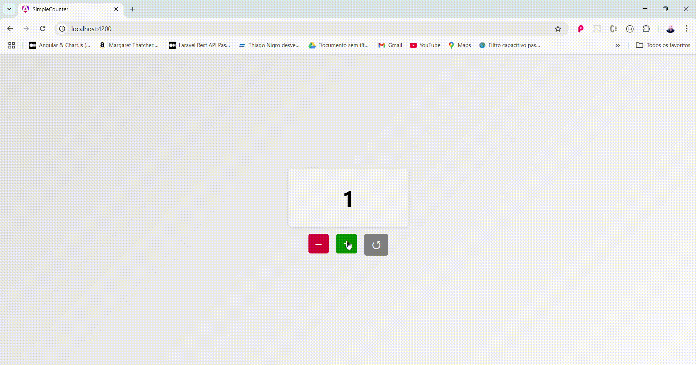

# 🧮 Simple Counter with Angular

> Basic project, but with important concepts, to practice modern Angular features such as Signals, Standalone Components, @Input(), @Output() and Data Binding.

## 📌 What is it

Application developed in Angular with a focus on learning and exploring:

- 🧠 Modern reactivity with Signals
- ⚙️ Reusable components
- 📥 Parent → Child communication with input
- 📤 Child → Parent communication with output
- 🎨 SCSS for custom styling
- 🌿 Standalone Components (without NgModules)

## 🎯 Features

- Centered card displaying the current value of the counter
- Three buttons: Increment, Decrement and Reset
- Each button is a reusable component with communication via events
- Visually pleasing application with **background gradient**, centered and responsive layout

